# TRIPMATEAI — Repositorio de entrega de la presentación

> TripMateAI: Plataforma inteligente de viajes con IA, donde puedes hacer reservas de vuelos, alojamientos, actividades y contiene un análisis de mercado.

<p align="center">
  
</p>

---

## Índice

1. [Personas del Proyecto](#personas-del-proyecto)
2. [Descripción del Proyecto](#descripción-del-proyecto)
   - [Funcionalidades principales](#funcionalidades-principales)
   - [Capturas de pantalla](#capturas-de-pantalla)
   - [Stack tecnológico](#stack-tecnológico)
3. [Aportacion por Modulos](#aportacion-por-modulos)
4. [Repositorios de Código](#repositorios-de-código)
5. [Artefacto de la app en producción](#artefacto-de-la-app-en-producción)
6. [Documentación Unificada](#documentación-unificada)
7. [Gestion del Proyecto Jira](#gestion-del-proyecto-jira)
8. [Documentacion de Codigo Compodoc](#documentacion-de-codigo-compodoc)
9. [App Android (APK)](#app-android-apk)
10. [Videos de la aplicación en funcionamiento en directo](#videos-de-la-aplicación-en-funcionamiento-en-directo)

---

## Personas del Proyecto

| Nombre completo | Rol en el proyecto |
|---|---|
| Alberto Maldonado Triana | Desarrollador / Diseñador |
| Javier Ballesteros Martinez | Desarrollador / Diseñador |

---

## Descripción del Proyecto

**TRIPMATEAI** es una plataforma web y móvil de planificación de viajes con Inteligencia Artificial que permite a los usuarios buscar, consultar o reservar vuelos y alojamientos, crear actividades en sus destinos, hablar con un asistente IA de viajes en tiempo real y consultar un panel de análisis de mercado con diferentes gráficos y filtros.

El proyecto contiene un frontend moderno usando **Angular** como tecnología principal, **Tailwind** para un estilo más actual y un backend en **Node** además de la base de datos y autenticación en **Firebase** y un análisis de datos con **Python/Pandas** y visualización de todos esos datos con un informe en **Power BI**, que en la misma aplicación web se podrá descargar.

### Funcionalidades principales de la app

- **Inicio** — Página principal con visual atractivo para el usuario y un acceso rápido a todas las secciones de la app desde una misma página, además de contener el footer.
- **Mis Reservas** — Panel con todas las reservas del usuario (vuelos y alojamientos), cuenta con un mapa interactivo con marcadores para ver la localización exacta de los alojamientos y tarjetas de detalle de cada una de las reservas.
- **Actividades** — Página donde puede crear una actividad cualquiera, vinculándola a una reserva de vuelo (es decir de viaje) incluyendo hora, fecha, precio, etc.
- **Reservar Vuelo** — Flujo real de como sería una reserva de un vuelo de 5 pasos: búsqueda de el vuelo → selección de vuelo → elección de asiento en el avión → datos del pasajero → pago.
- **Reservar Alojamiento** — Flujo real de como sería una reserva de alojamiento de 5 pasos con filtros por tipo (hotel, apartamento, villa) y fechas, mostrando un mapa en tiempo real, para poder ver el precio y la localización de un determinado departamento en tiempo real.
- **Chat IA** — Chat de IA que ayuda a los viajeros a poder realizar los viajes de una manera mucho más cómoda.
- **Análisis de Mercado** — Dashboard con datos globales, tendencias de ingresos, reservas por segmento y distribución por categoría; exportable a CSV/XLSX, y puede ser usado con filtros de fecha, país y poder exportar los datos filtrados, además de contener un informe en PowerBI.

### Capturas de pantalla

**Página de Login**
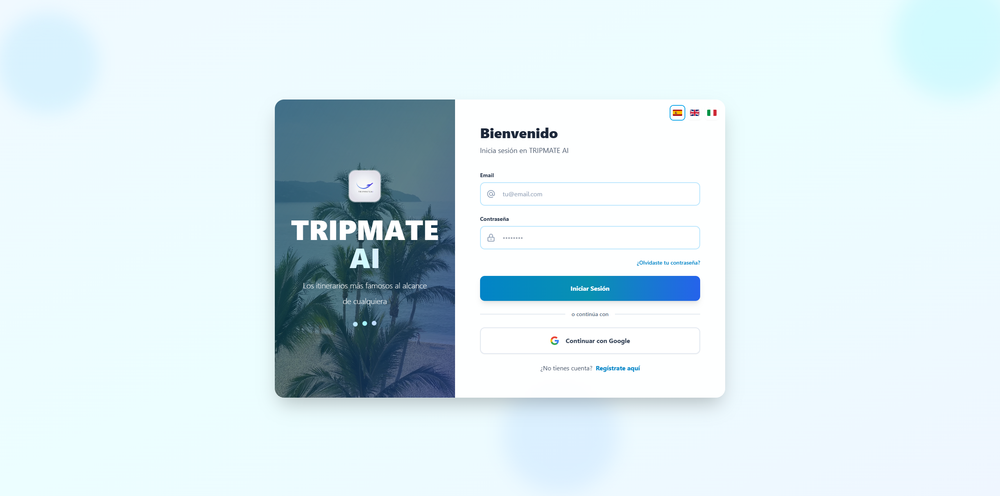

**Página de Registro**
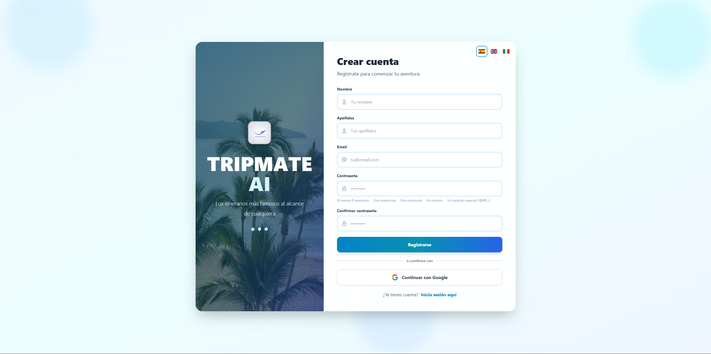

**Página de inicio**
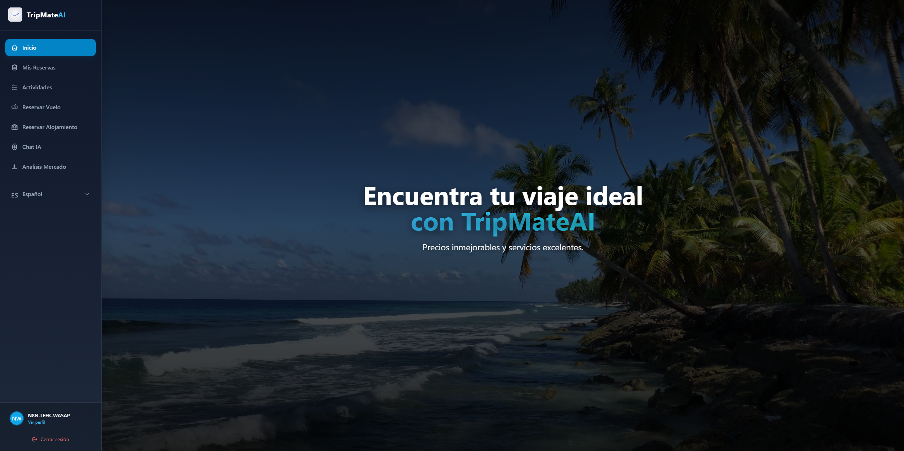
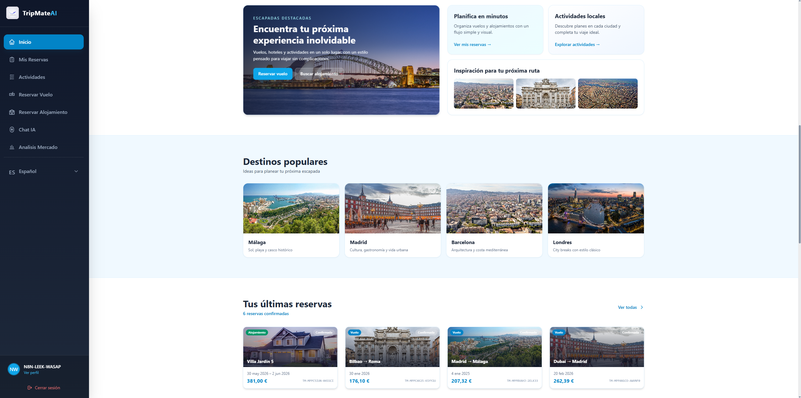
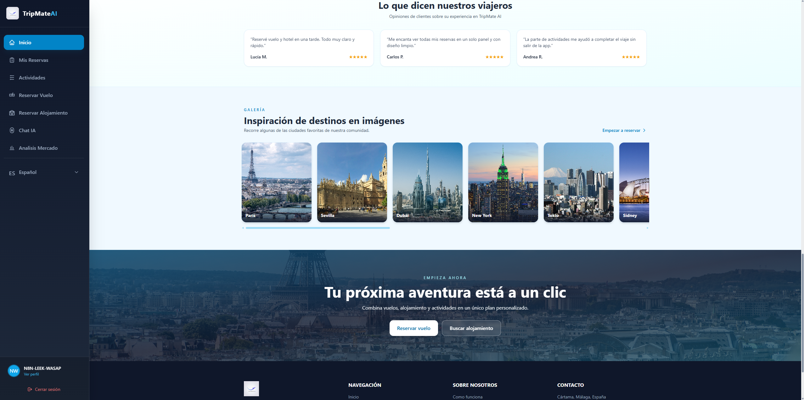

**Mis Reservas — Panel con mapa**
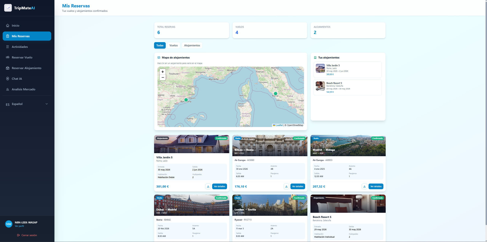

**Actividades**
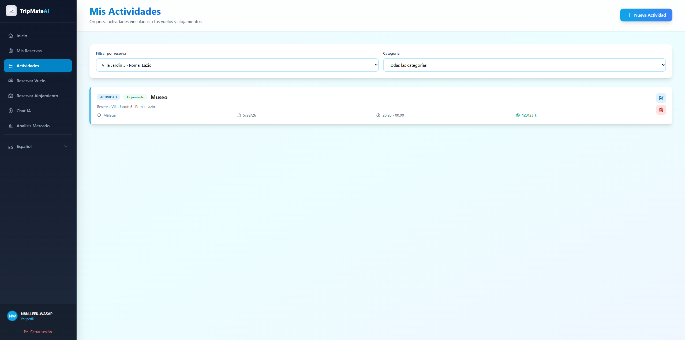

**Reservar Vuelo — Búsqueda**
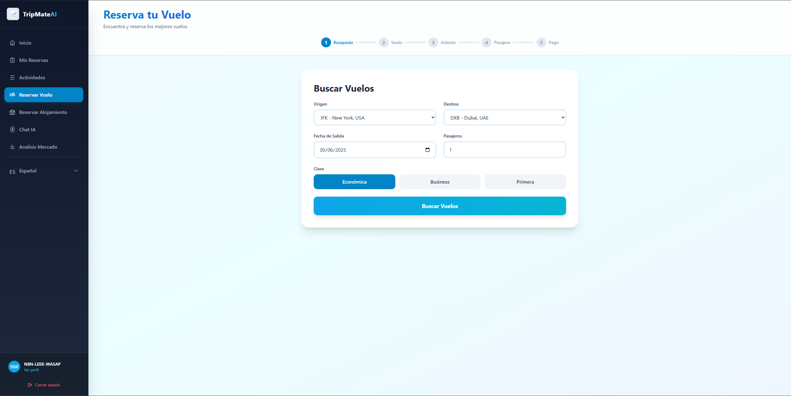
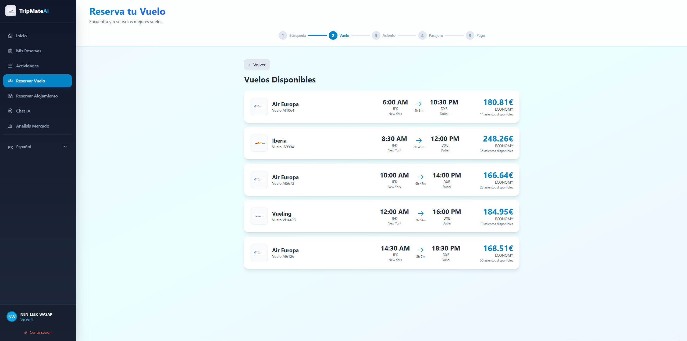
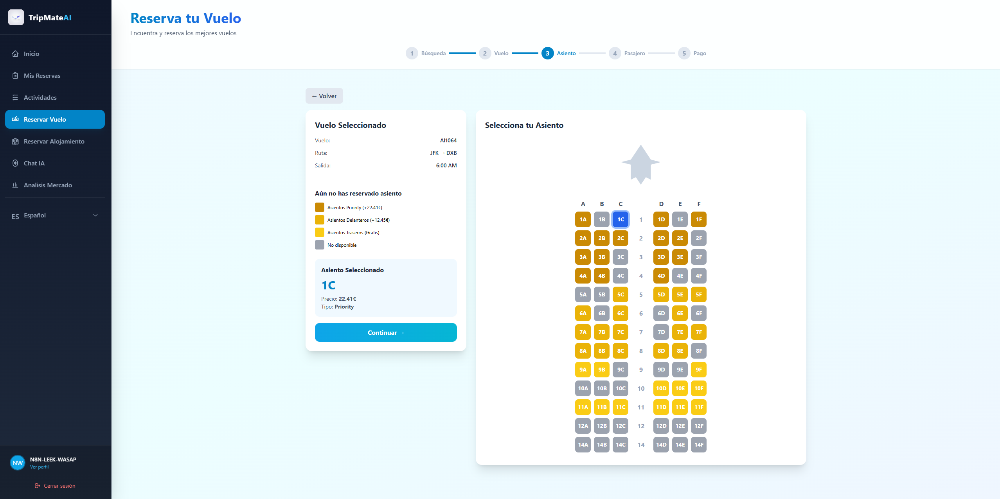
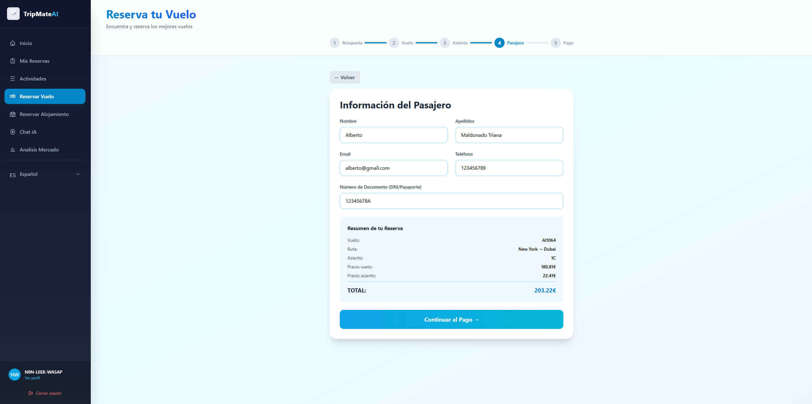

**Reservar Alojamiento — Búsqueda**
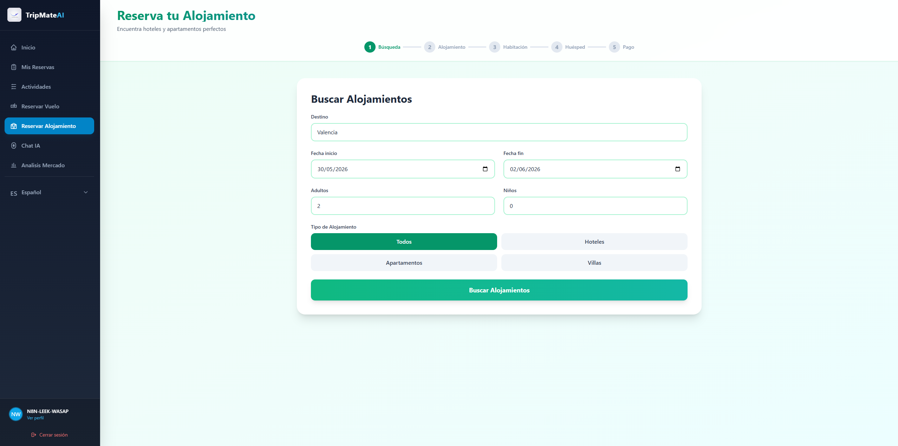
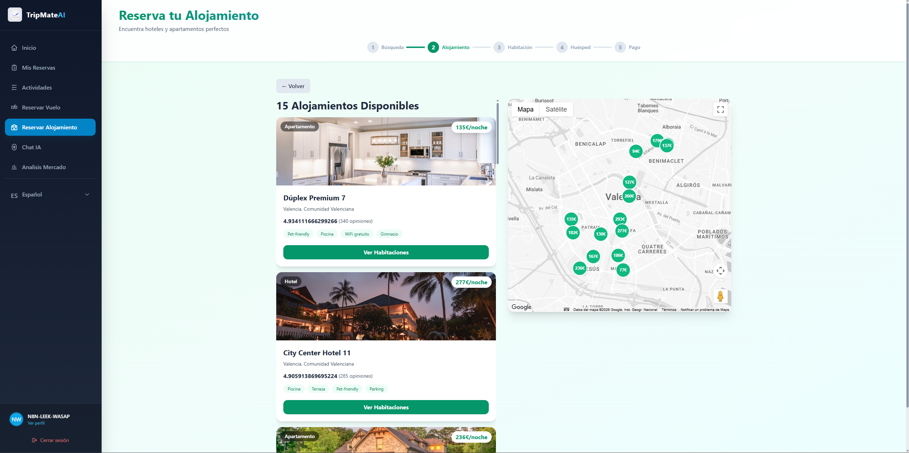
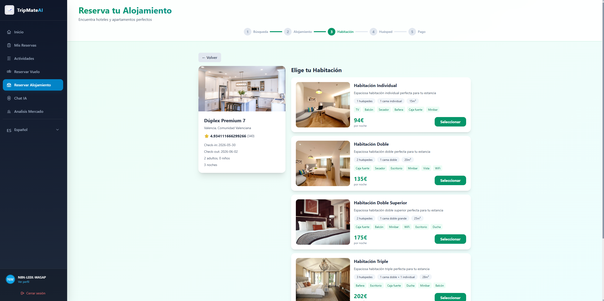
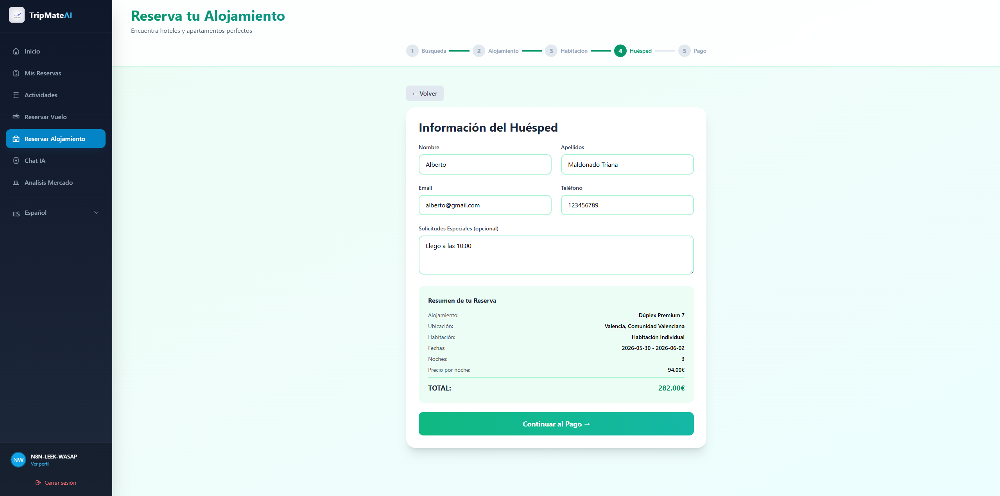

**Chat con IA**
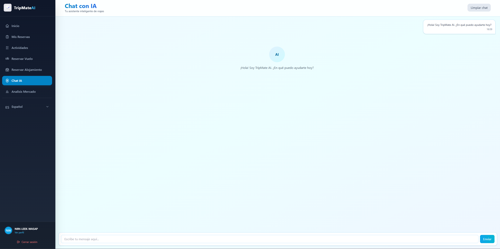

**Análisis de Mercado**
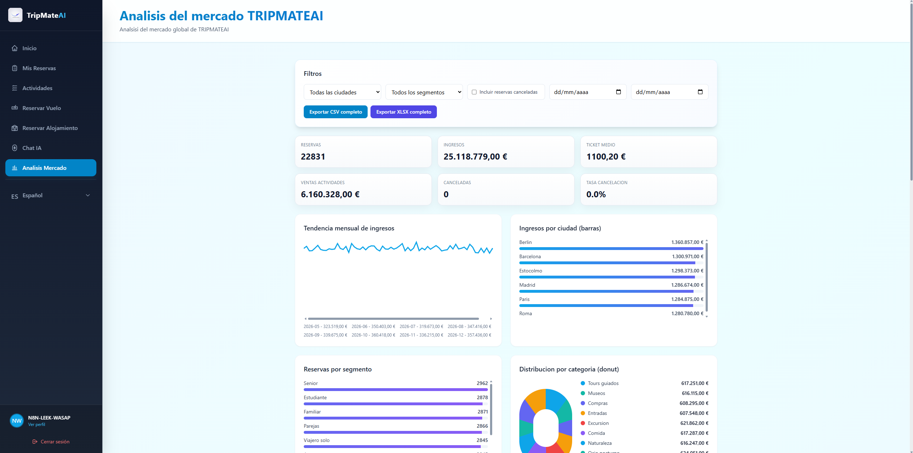
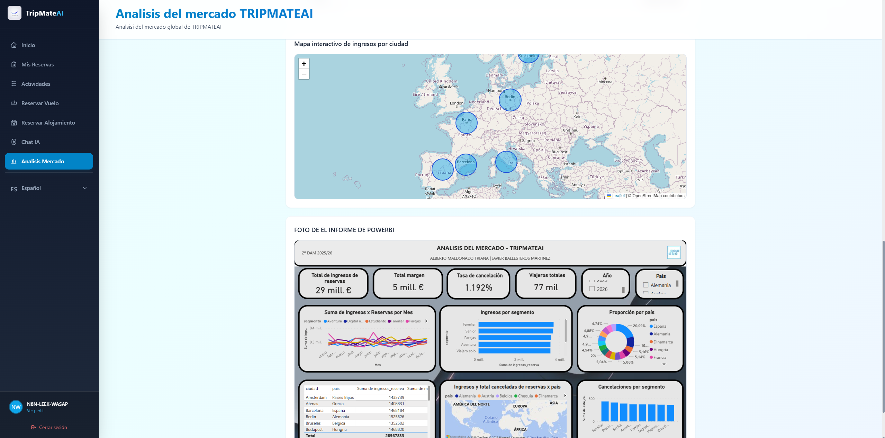

> Las capturas de pantalla están en la carpeta [`/capturasDePantalla`](./capturasDePantalla/) de este mismo repositorio.

### Stack tecnológico

| Capa | Tecnología |
|---|---|
| Frontend | Angular 19.2.0, TypeScript 5.7.2, Tailwind CSS 3.4.18 |
| Backend | Node ≥20, TypeScript, Express |
| Base de datos y Auth | Firebase (Firestore + Authentication) |
| Procesar los pagos en la app | Stripe |
| Mapas visibles en la app | Leaflet |
| Sistema de traducción | ngx-translate (i18n) |
| Análisis de datos | Python usando Pandas |
| Visualización del el informe | Power BI |
| Documentación de la API | Swagger |
| Seguridad de la API | Helmet, CORS, rate limiting, HPP, sanitización XSS, HTTPS forzado, logging (OWASP TOP 10)|
| Documentación código | Compodoc y Confluence |
| Despliegue | Vercel |
| Organización de el proyecto | Jira |

---

## Aportacion por Modulos

### Acceso a Datos
Gestión de datos con Firebase Firestore y a la autenticación de el usuario, además de el manejo de datos como puede ser el almacenamiento de reservas, vuelos, alojamientos y usuarios.
Profesorado que lo cursa: García Gómez, Juan Antonio

### Desarrollo de Interfaces
Integración en el módulo de Análisis de Mercado un análisis de Power BI totalmente funcional con los datos de la aplicación web.
Profesorado que lo cursa: Campos Fernández, Carmen

### Optativa — Diseño e Implementación de Infraestructuras de Servicios y APIs
Diseño e implementación de una API REST con Node y Express que expone los servicios del backend (búsqueda de vuelos y alojamientos, gestión de reservas). Usando también Firebase Authentication y Firestore para el guardado de los datos, y despliegue en infraestructura cloud con Vercel. Realización de el proceso de pago haciendo uso de la tecnología de Stripe para poder procesar todos los pagos. En el servidor Node realización de las mejoras de seguridad siguiendo los TOP 10 DE OWASP para mejorar la seguridad en el servidor.
Profesorado que lo cursa: García Gómez, Juan Antonio

### Programación de Servicios y Procesos
Configuración de el uso de la base de datos de Firebase en toda la aplicación móvil.
Profesorado que lo cursa: Hormigo Ramírez, David

### Programación Multimedia y Dispositivos Móviles
Desarrollo de la aplicación Android de TripMateAI en los dispositivos móviles, siguiendo con los estanderes basico de la creación de apps en android.
Profesorado que lo cursa: Hormigo Ramírez, David

### Proyecto Intermodular de Desarrollo de Aplicaciones Multiplataforma
Gestión del proyecto usando Jira y cada una de sus características como pueden ser: epics, sprints, tablero kanban y seguimiento de tareas. Además de la creación de toda la documentación que ha sido generada ya sea en en confluence o en compodoc. Incluir el sistema de traducción de I18N para poder traducir la app.
Profesorado que lo cursa: García Gómez, Juan Antonio

### Sistemas de Gestión Empresarial
Integración del módulo de Análisis de Mercado haciendo uso de Python y Pandas para el procesamiento y análisis de datos en el módulo de Análisis de Mercado, con exportación a CSV y XLSX con métricas de negocio (reservas, ingresos, ticket medio, tasa de cancelación). 
Profesorado que lo cursa: Ronda Carracao, Miguel Ángel

---

## Repositorios de Código

| Repositorio | Descripción | Enlace |
|---|---|---|
| Frontend | Aplicación Angular | [tripmateai-web-frontend](https://github.com/albertoomaldonadoo/TRIPMATEAI-WEB-FB) |
| Backend | API Node.js + Express | [tripmateai-backend](https://github.com/albertoomaldonadoo/NODE-SERVER-FB) |
| App Móvil | App de Android | [tripmateai-movil](https://github.com/albertoomaldonadoo/TRIPMATEAI-ANDROID) |
| Entrega para la presentación | README, APK, PDFs | [Proyecto-Intermodular_TRIPMATEAI](https://github.com/albertoomaldonadoo/Proyecto-Intermodular_TRIPMATEAI.git) |

---

## Artefacto de la app en producción

| Artefacto | URL / Acceso |
|---|---|
| Aplicación web | [https://tripmateai-web-fb.vercel.app/dashboard](https://tripmateai-web-fb.vercel.app) |
| Docuemntación web compodoc | [https://tripmateai-web-fb-documentacion.vercel.app](https://tripmateai-web-fb-documentacion.vercel.app) |
| Docuemntación web Swagger | [https://node-server-fb.vercel.app/api-docs/](https://node-server-fb.vercel.app/api-docs/) |
| Docuemntación Confluence | [https://g-team-mpfqw8oy.atlassian.net/wiki/x/AYAy](https://g-team-mpfqw8oy.atlassian.net/wiki/x/AYAy) |
| App Android (APK) | [Descargar APK](https://github.com/albertoomaldonadoo/Proyecto-Intermodular_TRIPMATEAI/releases) |

**Credenciales de prueba para la app:**

```
Email:    demo@tripmateai.com
Password: Demo1234!
```

---

## Documentación Unificada

| Documento | Enlace |
|---|---|
| Confluence (documentación completa) | [Ver en Confluence](https://g-team-mpfqw8oy.atlassian.net/wiki/x/AYAy) |
| Documentación de Confluence en PDF | [Ver PDF](./documentos/TripMateAI_Documentacion_Confluence.pdf) |
| Documentación de la API en Swagger | [Ver en Swagger](https://node-server-fb.vercel.app/api-docs/) |


> Los PDF se encuentran en la carpeta [`/documentos`](./documentos/) de este repositorio.  

---

## Gestion del Proyecto Jira

La gestión del proyecto se realizó con **Jira**, organizando el trabajo en epics, sprints y tareas individuales.

| Documento | Enlace |
|---|---|
| Resumen Jira (PDF) | [Ver PDF](./documentos/TripMateAI_Jira_Resumen.pdf) |

El PDF incluye:
- Tablero de tareas y epics
- Estadísticas de tareas por persona
- Burndown chart del sprint
- Estado final del backlog

---

## Documentacion de Codigo Compodoc

La documentación del código Angular ha sido generada automáticamente con **Compodoc** y está disponible en producción durante el período de evaluación.

| Recurso | Enlace |
|---|---|
| Compodoc desplegado | [https://tripmateai-web-fb-documentacion.vercel.app/](https://tripmateai-web-fb-documentacion.vercel.app/) |
| Compodoc en el repositorio y carpeta exacta | [https://github.com/albertoomaldonadoo/TRIPMATEAI-WEB-FB/tree/main/documentation](https://github.com/albertoomaldonadoo/TRIPMATEAI-WEB-FB/tree/main/documentation) |

---

## App Android (APK)

El APK de la aplicación Android de TripMateAI está disponible para descarga directa desde este repositorio para que se pueda descargar en un dispositivo Android y poder probar.

### Descargar el APK

**[Descargar TripMateAI.apk](https://github.com/albertoomaldonadoo/Proyecto-Intermodular_TRIPMATEAI/releases)**

O desde la sección de [Releases](https://github.com/albertoomaldonadoo/Proyecto-Intermodular_TRIPMATEAI/releases) de este repositorio.

## Videos de la aplicación en funcionamiento en directo

Videos de la aplicación desplegada para poder verificar su funcionamiento y poder visualizar cada uno de los módulos de una manera más especifica.

| Nombre de el video | URL de acceso |
|---|---|
| Video de registro | [https://youtu.be/VUbQEHAW70o](https://youtu.be/VUbQEHAW70o) |
| Video de login | [https://youtu.be/bUx_qGiFIvg](https://youtu.be/bUx_qGiFIvg) |
| Video de la home  | [https://youtu.be/MNN6qV2t0X8](https://youtu.be/MNN6qV2t0X8) |
| Video de mis reservas | [https://youtu.be/Yg-UvNX1LGY](https://youtu.be/Yg-UvNX1LGY) |
| Video de actividades  | [https://youtu.be/c5JUpUEypms](https://youtu.be/c5JUpUEypms) |
| Video de reservas de vuelo  | [https://youtu.be/IF1SaoLS7P4](https://youtu.be/IF1SaoLS7P4) |
| Video de reservas de alojamiento  | [https://youtu.be/DY9ThZadD7E](https://youtu.be/DY9ThZadD7E) |
| Video del analisis del mercado  | [https://youtu.be/Ix8WAPnvDq8](https://youtu.be/Ix8WAPnvDq8) |
| Video de la app traducida a los diferentes idiomas  | [https://youtu.be/hD6smzr5rj0](https://youtu.be/hD6smzr5rj0) |