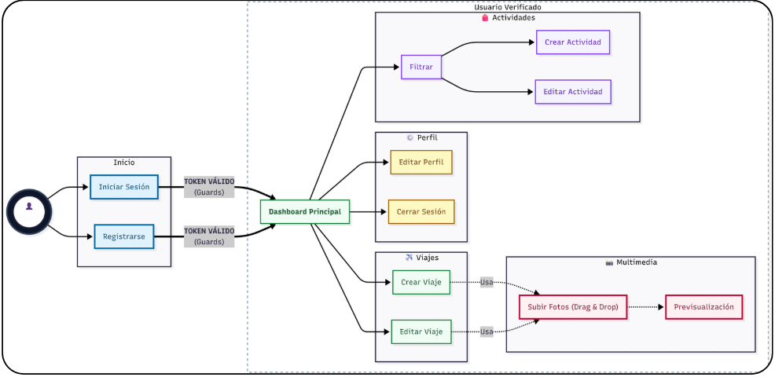
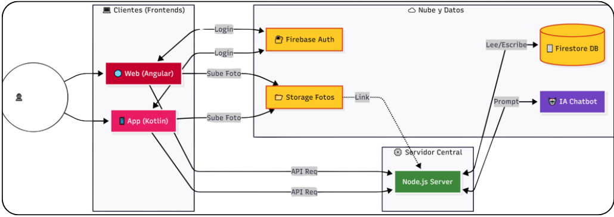
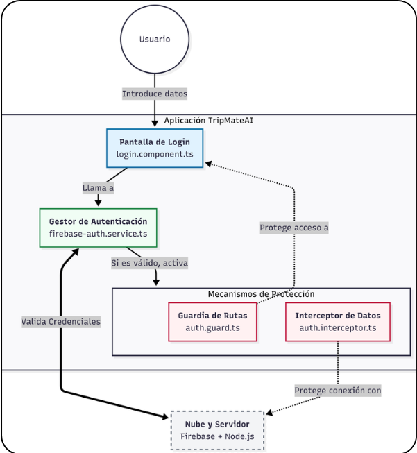
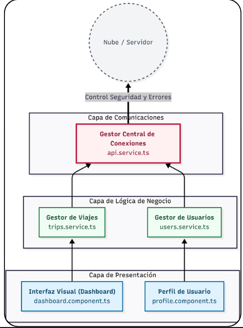

# TRIPMATEAI — Repositorio de entrega de la presentación

> TripMateAI: Plataforma inteligente de viajes con IA, donde puedes hacer reservas de vuelos, alojamientos, actividades y contiene un análisis de mercado.

<p align="center">
  
</p>

<p align="center">
  <a href="https://tripmateai-web-fb.vercel.app" target="_blank" rel="noopener noreferrer">
    
  </a>
  &nbsp;
  <a href="https://canva.link/na7a01xjtarzlqx">
    
  </a>
  &nbsp;
  <a href="#artefacto-de-la-app-en-producción">
    
  </a>
</p>

## Enlace a la presentación

Enlace a la presentación completa de aplicación: [Presentación TRIPMATEAI](https://canva.link/na7a01xjtarzlqx)

Enlace a el PDF de la presentación (Los videos no son visibles aquí por el formato PDF): [Presentación PDF TRIPMATEAI](./documentos/TRIPMATEPRESENTACIONFINAL.pdf)

<p align="center">
  
</p>

## Índice

1. [Personas del Proyecto](#personas-del-proyecto)
2. [Descripción del Proyecto](#descripción-del-proyecto)
   - [Funcionalidades principales](#funcionalidades-principales)
   - [Capturas de pantalla](#capturas-de-pantalla)
   - [Stack tecnológico](#stack-tecnológico)
3. [Aportacion por Modulos](#aportacion-por-modulos)
4. [Repositorios de Código](#repositorios-de-código)
5. [Artefacto de la app en producción](#artefacto-de-la-app-en-producción)
6. [Documentación Unificada](#documentación-unificada)
   - [Diagramas y arquitectura técnica](#diagramas-y-arquitectura-técnica)
7. [Gestion del Proyecto Jira](#gestion-del-proyecto-jira)
8. [Documentacion de Codigo Compodoc](#documentacion-de-codigo-compodoc)
9. [App Android (APK)](#app-android-apk)
10. [Videos de la aplicación en funcionamiento en directo](#videos-de-la-aplicación-en-funcionamiento-en-directo)

<p align="center">
  
</p>

## Personas del Proyecto

| Nombre completo | Rol en el proyecto |
|---|---|
| Alberto Maldonado Triana | Desarrollador / Diseñador |
| Javier Ballesteros Martinez | Desarrollador / Diseñador |

<p align="center">
  
</p>

## Descripción del Proyecto

**TRIPMATEAI** es una plataforma web y móvil de planificación de viajes con Inteligencia Artificial que permite a los usuarios buscar, consultar o reservar vuelos y alojamientos, crear actividades en sus destinos, hablar con un asistente IA de viajes en tiempo real y consultar un panel de análisis de mercado con diferentes gráficos y filtros.

El proyecto contiene un frontend moderno usando **Angular** como tecnología principal, **Tailwind** para un estilo más actual y un backend en **Node** además de la base de datos y autenticación en **Firebase** y un análisis de datos con **Python/Pandas** y visualización de todos esos datos con un informe en **Power BI**, que en la misma aplicación web se podrá descargar.

### Funcionalidades principales de la app

- **Inicio** — Página principal con visual atractivo para el usuario y un acceso rápido a todas las secciones de la app desde una misma página, además de contener el footer.
- **Mis Reservas** — Panel con todas las reservas del usuario (vuelos y alojamientos), cuenta con un mapa interactivo con marcadores para ver la localización exacta de los alojamientos y tarjetas de detalle de cada una de las reservas.
- **Actividades** — Página donde puede crear una actividad cualquiera, vinculándola a una reserva de vuelo (es decir de viaje) incluyendo hora, fecha, precio, etc.
- **Reservar Vuelo** — Flujo real de como sería una reserva de un vuelo de 5 pasos: búsqueda de el vuelo → selección de vuelo → elección de asiento en el avión → datos del pasajero → pago.
- **Reservar Alojamiento** — Flujo real de como sería una reserva de alojamiento de 5 pasos con filtros por tipo (hotel, apartamento, villa) y fechas, mostrando un mapa en tiempo real, para poder ver el precio y la localización de un determinado departamento en tiempo real.
- **Chat IA** — Chat de IA que ayuda a los viajeros a poder realizar los viajes de una manera mucho más cómoda.
- **Análisis de Mercado** — Dashboard con datos globales, tendencias de ingresos, reservas por segmento y distribución por categoría; exportable a CSV/XLSX, y puede ser usado con filtros de fecha, país y poder exportar los datos filtrados, además de contener un informe en PowerBI.

### Capturas de pantalla

**Página de Login**


**Página de Registro**


**Página de inicio**


**Mis Reservas — Panel con mapa**


**Actividades**


**Reservar Vuelo — Búsqueda**


**Reservar Alojamiento — Búsqueda**


**Chat con IA**


**Análisis de Mercado**


> Las capturas de pantalla están en la carpeta [`/capturasDePantalla`](./capturasDePantalla/) de este mismo repositorio.

<p align="center">
  
</p>

### Stack tecnológico

| Capa | Tecnología |
|---|---|
| Frontend | Angular 19.2.0, TypeScript 5.7.2, Tailwind CSS 3.4.18 |
| Backend | Node ≥20, TypeScript, Express |
| Base de datos y Auth | Firebase (Firestore + Authentication) |
| Procesar los pagos en la app | Stripe |
| Mapas visibles en la app | Leaflet |
| Sistema de traducción | ngx-translate (i18n) |
| Análisis de datos | Python usando Pandas |
| Visualización del el informe | Power BI |
| Documentación de la API | Swagger |
| Seguridad de la API | Helmet, CORS, rate limiting, HPP, sanitización XSS, HTTPS forzado, logging (OWASP TOP 10)|
| Documentación código | Compodoc y Confluence |
| Despliegue | Vercel |
| Organización de el proyecto | Jira |

<p align="center">
  
</p>

## Aportacion por Modulos

### Acceso a Datos
- **Profesorado que lo cursa** — García Gómez, Juan Antonio

Gestión de datos con Firebase Firestore y a la autenticación de el usuario, además de el manejo de datos como puede ser el almacenamiento de reservas, vuelos, alojamientos y usuarios.


### Desarrollo de Interfaces
- **Profesorado que lo cursa** — Campos Fernández, Carmen

Integración en el módulo de Análisis de Mercado un análisis de Power BI totalmente funcional con los datos de la aplicación web.


### Optativa — Diseño e Implementación de Infraestructuras de Servicios y APIs
- **Profesorado que lo cursa** — García Gómez, Juan Antonio

Diseño e implementación de una API REST con Node y Express que expone los servicios del backend (búsqueda de vuelos y alojamientos, gestión de reservas). Usando también Firebase Authentication y Firestore para el guardado de los datos, y despliegue en infraestructura cloud con Vercel. Realización de el proceso de pago haciendo uso de la tecnología de Stripe para poder procesar todos los pagos. En el servidor Node realización de las mejoras de seguridad siguiendo los TOP 10 DE OWASP para mejorar la seguridad en el servidor.


### Programación de Servicios y Procesos
- **Profesorado que lo cursa** — Hormigo Ramírez, David

Configuración de el uso de la base de datos de Firebase en toda la aplicación móvil.


### Programación Multimedia y Dispositivos Móviles
- **Profesorado que lo cursa** — Hormigo Ramírez, David

Desarrollo de la aplicación Android de TripMateAI en los dispositivos móviles, siguiendo con los estanderes basico de la creación de apps en android.


### Proyecto Intermodular de Desarrollo de Aplicaciones Multiplataforma
- **Profesorado que lo cursa** — García Gómez, Juan Antonio

Gestión del proyecto usando Jira y cada una de sus características como pueden ser: epics, sprints, tablero kanban y seguimiento de tareas. Además de la creación de toda la documentación que ha sido generada ya sea en en confluence o en compodoc. 


### Sistemas de Gestión Empresarial
- **Profesorado que lo cursa** — Ronda Carracao, Miguel Ángel

Integración del módulo de Análisis de Mercado haciendo uso de Python y Pandas para el procesamiento y análisis de datos en el módulo de Análisis de Mercado, con exportación a CSV y XLSX con métricas de negocio (reservas, ingresos, ticket medio, tasa de cancelación). 


### Inglés Profesional GS
- **Profesorado que lo cursa** — Sánchez García, José Emilio

Relizar el funcionamiento de el sistema de traducción de I18N para poder traducir la app, en varios idiomas concretamente en inglés.

<p align="center">
  
</p>

## Repositorios de Código

| Repositorio | Descripción | Enlace |
|---|---|---|
| Frontend | Aplicación Angular | <a href="https://github.com/albertoomaldonadoo/TRIPMATEAI-WEB-FB" target="_blank" rel="noopener noreferrer">tripmateai-web-frontend</a> |
| Backend | API Node.js + Express | <a href="https://github.com/albertoomaldonadoo/NODE-SERVER-FB" target="_blank" rel="noopener noreferrer">tripmateai-backend</a> |
| App Móvil | App de Android | <a href="https://github.com/albertoomaldonadoo/TRIPMATEAI-ANDROID" target="_blank" rel="noopener noreferrer">tripmateai-movil</a> |
| Entrega para la presentación | README, APK, PDFs | <a href="https://github.com/albertoomaldonadoo/Proyecto-Intermodular_TRIPMATEAI.git" target="_blank" rel="noopener noreferrer">Proyecto-Intermodular_TRIPMATEAI</a> |

<p align="center">
  
</p>

## Artefacto de la app en producción

| Artefacto | URL / Acceso |
|---|---|
| Aplicación web | <a href="https://tripmateai-web-fb.vercel.app" target="_blank" rel="noopener noreferrer">https://tripmateai-web-fb.vercel.app/dashboard</a> |
| Docuemntación web compodoc | <a href="https://tripmateai-web-fb-documentacion.vercel.app" target="_blank" rel="noopener noreferrer">https://tripmateai-web-fb-documentacion.vercel.app</a> |
| Docuemntación web Swagger | <a href="https://node-server-fb.vercel.app/api-docs/" target="_blank" rel="noopener noreferrer">https://node-server-fb.vercel.app/api-docs/</a> |
| Docuemntación Confluence | <a href="https://g-team-mpfqw8oy.atlassian.net/wiki/x/AYAy" target="_blank" rel="noopener noreferrer">https://g-team-mpfqw8oy.atlassian.net/wiki/x/AYAy</a> |
| App Android (APK) | <a href="https://github.com/albertoomaldonadoo/Proyecto-Intermodular_TRIPMATEAI/releases" target="_blank" rel="noopener noreferrer">Descargar APK</a> |

**Credenciales de prueba para la app:**

```
Email:    demo@tripmateai.com
Password: Demo1234!
```

<p align="center">
  
</p>

## Documentación Unificada

| Documento | Enlace |
|---|---|
| Confluence (documentación completa) | <a href="https://g-team-mpfqw8oy.atlassian.net/wiki/x/AYAy" target="_blank" rel="noopener noreferrer">Ver en Confluence</a> |
| Documentación de Confluence en PDF | <a href="./documentos/TripMateAI_Documentacion_Confluence.pdf" target="_blank" rel="noopener noreferrer">Ver PDF</a> |
| Documentación de la API en Swagger | <a href="https://node-server-fb.vercel.app/api-docs/" target="_blank" rel="noopener noreferrer">Ver en Swagger</a> |

> Los PDF se encuentran en la carpeta <a href="./documentos/" target="_blank" rel="noopener noreferrer"><code>/documentos</code></a> de este repositorio.


<p align="center">
  
</p>

## Diagramas y arquitectura técnica

Muestra de los difentes diagramas para la realización del proyecto. En cada fila, a la izquierda, el título y una breve explicación; a la derecha, la imagen del diagrama.

<table>
<tr>
<td width="50%" valign="top">
<strong>Diagrama de casos de uso</strong><br/><br/>
Diagrama que define quién interactúa con el sistema y qué puede hacer las acciones. Incluye al <em>usuario</em> que puede hacer: (registro, reservas, actividades, chat IA, análisis) y la relación con servicios como Firebase, Stripe y la API de vuelos/alojamientos.
</td>
<td width="50%" align="center" valign="middle">

</td>
</tr>
<tr><td colspan="2"><hr style="border:0;border-top:1px solid #D0D7DE;margin:16px 0"/></td></tr>
<tr>
<td width="50%" valign="top">
<strong>Diagrama de flujo</strong><br/><br/>
Muestra los pasos que sigue la aplicación en los procesos como: el acceso al sistema, búsqueda y reserva de vuelo o alojamiento, pago de las reservas, creación de actividades y consulta del panel de análisis de mercado.
</td>
<td width="50%" align="center" valign="middle">

</td>
</tr>
<tr><td colspan="2"><hr style="border:0;border-top:1px solid #D0D7DE;margin:16px 0"/></td></tr>
<tr>
<td width="50%" valign="top">
<strong>Servicio de autenticación</strong><br/><br/>
Uso del módulo de identidad con <strong>Firebase Authentication</strong>: formularios de login/registro en Angular, validación de tokens, persistencia de sesión y sincronización del perfil de usuario con Firestore.
</td>
<td width="50%" align="center" valign="middle">

</td>
</tr>
<tr><td colspan="2"><hr style="border:0;border-top:1px solid #D0D7DE;margin:16px 0"/></td></tr>
<tr>
<td width="50%" valign="top">
<strong>Servicio de comunicación</strong><br/><br/>
Muestra cómo se conectan las diferentes capas de la aplicación: el cliente (web y móvil) envía peticiones REST al backend <strong>Node/Express</strong>, que consulta Firebase, APIs externas y devuelve los datos a los componentes de la interfaz.
</td>
<td width="50%" align="center" valign="middle">

</td>
</tr>
</table>

<p align="center">
  
</p>

## Gestion del Proyecto Jira

La gestión del proyecto se realizó con **Jira**, organizando el trabajo en epics, sprints y tareas individuales.

| Documento | Enlace |
|---|---|
| Resumen Jira (PDF) | <a href="./documentos/RESUMEN-JIRA-TRIPMATEAI.pdf" target="_blank" rel="noopener noreferrer">Ver PDF</a> |

El PDF incluye:
- Tablero de tareas y epics
- Estadísticas de tareas por persona
- Burndown chart del sprint
- Estado final del backlog

<p align="center">
  
</p>

## Documentacion de Codigo Compodoc

La documentación del código Angular ha sido generada automáticamente con **Compodoc** y está disponible en producción durante el período de evaluación.

| Recurso | Enlace |
|---|---|
| Compodoc desplegado | <a href="https://tripmateai-web-fb-documentacion.vercel.app/" target="_blank" rel="noopener noreferrer">https://tripmateai-web-fb-documentacion.vercel.app/</a> |
| Compodoc en el repositorio y carpeta exacta | <a href="https://github.com/albertoomaldonadoo/TRIPMATEAI-WEB-FB/tree/main/documentation" target="_blank" rel="noopener noreferrer">https://github.com/albertoomaldonadoo/TRIPMATEAI-WEB-FB/tree/main/documentation</a> |

<p align="center">
  
</p>

## App Android (APK)

El APK de la aplicación Android de TripMateAI está disponible para descarga directa desde este repositorio para que se pueda descargar en un dispositivo Android y poder probar.

### Descargar el APK

**<a href="https://github.com/albertoomaldonadoo/Proyecto-Intermodular_TRIPMATEAI/releases" target="_blank" rel="noopener noreferrer">Descargar TripMateAI.apk</a>**

O desde la sección de <a href="https://github.com/albertoomaldonadoo/Proyecto-Intermodular_TRIPMATEAI/releases" target="_blank" rel="noopener noreferrer">Releases</a> de este repositorio.

<p align="center">
  
</p>

## Videos de la aplicación en funcionamiento en directo

Videos de la aplicación desplegada para poder verificar su funcionamiento y poder visualizar cada uno de los módulos de una manera más especifica.

| Nombre del video | Vista previa (clic para reproducir) |
|---|---|
| Video de registro | <a href="https://youtu.be/VUbQEHAW70o" target="_blank" rel="noopener noreferrer"></a> |
| Video de login | <a href="https://youtu.be/bUx_qGiFIvg" target="_blank" rel="noopener noreferrer"></a> |
| Video de la home | <a href="https://youtu.be/MNN6qV2t0X8" target="_blank" rel="noopener noreferrer"></a> |
| Video de mis reservas | <a href="https://youtu.be/Yg-UvNX1LGY" target="_blank" rel="noopener noreferrer"></a> |
| Video de actividades | <a href="https://youtu.be/c5JUpUEypms" target="_blank" rel="noopener noreferrer"></a> |
| Video de reservas de vuelo | <a href="https://youtu.be/IF1SaoLS7P4" target="_blank" rel="noopener noreferrer"></a> |
| Video de reservas de alojamiento | <a href="https://youtu.be/DY9ThZadD7E" target="_blank" rel="noopener noreferrer"></a> |
| Video del analisis del mercado | <a href="https://youtu.be/Ix8WAPnvDq8" target="_blank" rel="noopener noreferrer"></a> |
| Video de la app traducida a los diferentes idiomas | <a href="https://youtu.be/hD6smzr5rj0" target="_blank" rel="noopener noreferrer"></a> |
